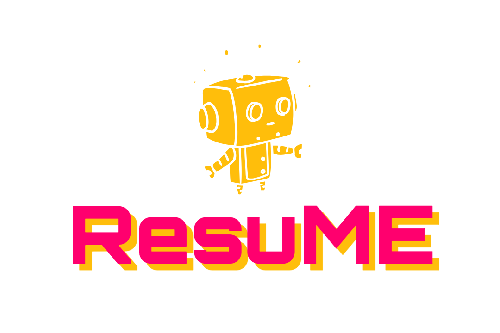

<!-- Improved compatibility of back to top link: See: https://github.com/othneildrew/Best-README-Template/pull/73 -->
<a name="readme-top"></a>
<!--
*** Thanks for checking out the Best-README-Template. If you have a suggestion
*** that would make this better, please fork the repo and create a pull request
*** or simply open an issue with the tag "enhancement".
*** Don't forget to give the project a star!
*** Thanks again! Now go create something AMAZING! :D
-->


<!-- PROJECT SHIELDS -->
<!--
*** I'm using markdown "reference style" links for readability.
*** Reference links are enclosed in brackets [ ] instead of parentheses ( ).
*** See the bottom of this document for the declaration of the reference variables
*** for contributors-url, forks-url, etc. This is an optional, concise syntax you may use.
*** https://www.markdownguide.org/basic-syntax/#reference-style-links
-->

<div align="center">

[![Contributors][contributors-shield]][contributors-url]
[![Forks][forks-shield]][forks-url]
[![Stargazers][stars-shield]][stars-url]
[![Issues][issues-shield]][issues-url]
[![MIT License][license-shield]][license-url]

</div>


<!-- PROJECT LOGO -->
<br />
<div align="center">
  <a href="https://github.com/TuWeile/microsoftHackathon">
    
  </a>

<h3 align="center">ResuME</h3>

  <p align="center">
    OpenAI chatbot emulator of job applicants with Azure CosmosDB and Langchain
    <br />
    <a href="https://github.com/TuWeile/microsoftHackathon"><strong>Explore the docs »</strong></a>
    <br />
    <br />
    <a href="https://github.com/TuWeile/microsoftHackathon">Documentation</a>
    ·
    <a href="https://github.com/TuWeile/microsoftHackathon/issues">Report Bug</a>
    ·
    <a href="https://github.com/TuWeile/microsoftHackathon/issues">Request Feature</a>
  </p>
</div>


<!-- TABLE OF CONTENTS -->
<details>
  <summary>Table of Contents</summary>
  <ol>
    <li>
      <a href="#about-the-project">About The Project</a>
      <ul>
        <li><a href="#built-with">Built With</a></li>
      </ul>
    </li>
    <li>
      <a href="#getting-started">Getting Started</a>
      <ul>
        <li><a href="#prerequisites">Prerequisites</a></li>
        <li><a href="#installation">Installation</a></li>
      </ul>
    </li>
    <li><a href="#usage">Usage</a></li>
    <li><a href="#roadmap">Roadmap</a></li>
    <li><a href="#contributing">Contributing</a></li>
    <li><a href="#license">License</a></li>
    <li><a href="#contact">Contact</a></li>
    <li><a href="#acknowledgments">Acknowledgments</a></li>
  </ol>
</details>


<!-- ABOUT THE PROJECT -->
## About The Project

[![Illustration of Chatbot Demo][product-screenshot]](https://github.com/TuWeile/microsoftHackathon)

This repository serves in fulfillment of the requirements for the [Microsoft Develops AI Learning Hackathon 2024 in 
Devpost][hackathon-url], where developers are expected to integrate their custom AI co-pilot developed during Phase 1
onto Azure with Azure CosmosDB explaining the use case, functionality, and how their application matters. Inspired by 
our earlier endeavors in customized chatbots, our team has developed ResuME, a friendly chatbot designed to empower 
job applicants in their job search by leveraging on the use of Generative AI from OpenAI models to emulate their 
professional profiles and win the confidence of prospective employers. Our team hopes that through this endeavor, 
future enhancements and improvements can be made to help augment jobseekers' ability to present themselves effectively, 
tailor their resumes to specific job requirements, and receive personalized career advice. By continually refining 
ResuME, we aim to make the job application process more efficient, accessible, and successful for all users, 
ultimately contributing to a more dynamic and inclusive job market.

<p align="right">(<a href="#readme-top">back to top</a>)</p>


### Built With

* [![Python][Python.lg]][Python-url]
* [![Typescript][Typescript.lg]][Typescript-url]
* [![React][React.lg]][React-url]
* [![Docker][Docker.lg]][Docker-url]
* [![Azure][Azure.lg]][Azure-url]

<p align="right">(<a href="#readme-top">back to top</a>)</p>


<!-- GETTING STARTED -->
## Getting Started

Before getting this submission to run locally within your computer, ensure that the following prerequisites are 
fulfilled:

### Prerequisites

* You must have Docker installed in your computer with an internet connection.
* You must have your own generated OpenAI keys and endpoints and Azure CosmosDB with MongoDB (VCore) connection string 
generated from [Azure](https://portal.azure.com/).

### Installation

#### Without Docker Compose
1. Copy the OpenAI key and endpoints along with your Azure CosmoDB connection string into `config.ini`.
2. Using your Terminal, change your directory to the directory `microsoftHackathon` where the Dockerfile for the Python 
backend is located. Run the following command in the Terminal.
  ```shell
  docker build --pull --rm -f "Dockerfile" -t devguidebackendapi:latest "."
  ```
3. Within that same directory, use your Terminal to change your directory to the directory `react-frontend` where
another Dockerfile for the React-TS frontend is located. Run the following command in the Terminal.
  ```shell
  docker build -t resu.me-frontend:1.0 .
  ```
4. With both images installed, first initialize the Python backend service by entering the following command in the
Terminal. Ensure that port 4242 is open.
  ```shell
  docker run -d -p 4242:80 --name devguide-backend-api devguidebackendapi:latest
  ```
5. With the Python backend service initialized, enter the next following command in the Terminal. Ensure that port 
3000 is open.
  ```shell
  docker run -d -p 3000:80 --name resu.me-frontend resu.me-frontend:1.0
  ```
6. Once both containers have been initialized and are running, go to http://localhost:3000 to interact with the 
application.

<p align="right">(<a href="#readme-top">back to top</a>)</p>

#### With Docker Compose
1. Copy the OpenAI key and endpoints along with your Azure CosmosDB connection string into `config.ini`.
2. Using your Terminal, change your directory to the directory `microsoftHackathon` where the project is located. Run 
the following command in the Terminal.
  ```shell
  docker-compose up
  ```
3. You should observe both `microsofthackathon-frontend` and `microsoft-backend` container initialized and running. Go 
to http://localhost:3000 to interact with the application.

<p align="right">(<a href="#readme-top">back to top</a>)</p>

#### With Microsoft Azure
<b><i>Disclaimer:</b> Microsoft Azure platform can only host [AMD64 architecture-built containers][overflow-disclaimer] 
as of Jun 2024. Ensure that you ideally have a Windows AMD64 OS for deployment, M1 MacOS not recommended.</i>
1. Copy the OpenAI key and endpoints along with your Azure CosmosDB connection string into `config.ini`.
2. Ensure that you have [Azure CLI](https://learn.microsoft.com/en-us/cli/azure/install-azure-cli) installed within your
computer along with a valid Azure account.
3. With your Azure CLI, login to Azure with:
  ```shell
  az login
  ```
4. If you do not have an existing Azure Container Registry, create a registry with:
  ```shell
  az acr create --resource-group <resource-group> --name <registry-name> --sku Basic
  ```
5. Login into your Azure Container Registry:
  ```shell
  az acr login --name <registry-name>
  ```
6. Using your Terminal, change your directory to the directory `microsoftHackathon` where the Dockerfile for the Python 
backend is located. Run the following command in the Terminal.
  ```shell
  docker build --pull --rm -f "Dockerfile" -t resu.me-backend:1.0 "."
  ```
7. Tag your docker image by replacing `<registry-name>` with your Azure Container Registry name.
  ```shell
  docker tag resu.me-backend:1.0 <registry-name>.azurecr.io/resu.me-backend:1.0
  ```
8. Push your Python backend Docker image to Azure Container Registry.
  ```shell
  docker push <registry-name>.azurecr.io/resu.me-backend:1.0
  ```
9. Add the extension `containerapp` in order to prepare initialization of container applications on Azure.
  ```shell
  az extension add --name containerapp --upgrade
  ```
10. Initialize your container application with the Python backend Docker image that was pushed into Azure Container 
registry. You may initialize your environment with this command too.
  ```shell
  az containerapp up --name resume-backend \
                     --image <registry-name>.azurecr.io/resu.me-backend:1.0 \
                     --resource-group <resource-group> \
                     --environment <environment-name> \
                     --ingress external
  ```

11. In Azure Web Portal, go to `resume-backend` Container App from your resource group and obtain the Application URL.
  ```text
  https://resume-backend.<identifier>.eastus.azurecontainerapps.io
  ```

12. Within this project, refactor all `http://localhost:4242` mentions into `https://resume-backend.<identifier>.eastus.azurecontainerapps.io`.
This will ensure that your frontend will map correctly to your running backend application on Azure.

13. Within that project, use your Terminal to change your directory to the directory `react-frontend` where
another Dockerfile for the React-TS frontend is located. Run the following command in the Terminal.
  ```shell
  docker build -t resu.me-frontend:1.0 .
  ```

14. Repeat step 7 to step 10 with the shell commands in Terminal:
  ```shell
  docker tag resu.me-frontend:1.0 <registry-name>.azurecr.io/resu.me-frontend:1.0
  
  docker push <registry-name>.azurecr.io/resu.me-frontend:1.0
  
  az containerapp up --name resume-frontend \
                     --image <registry-name>.azurecr.io/resu.me-frontend:1.0 \
                     --resource-group <resource-group> \
                     --environment <environment-name> \
                     --ingress external
  ```

15. In Azure Web Portal, go to `resume-frontend` Container App from your resource group and obtain the Application URL. 
You can now access the application from there.
  ```text
  https://resume-frontend.<identifier>.eastus.azurecontainerapps.io
  ```

16. Should you require a static webapp hostname, create an Azure Web App interface and type out your preferred domain. 
Ensure that your configurations are set to deploy <b>containers</b>. Your hostname should look like this:
  ```text
  https://<desired-hostname>.azurewebsites.net/
  ```

17. In the container step, select your configuration as follows.
  ```text
  Container Type:   Docker Compose (Preview)
  Registry source:  Azure Container Registry
  Registry:         <registry-name>
  Config:           Attach aci-deploy.yml
  ```

18. From `https://<desired-hostname>.azurewebsites.net/`, you can now access your application online.

<p align="right">(<a href="#readme-top">back to top</a>)</p>

[//]: # (<!-- USAGE EXAMPLES -->)

[//]: # (## Usage)

[//]: # ()
[//]: # (TBA)

[//]: # ()
[//]: # (<p align="right">&#40;<a href="#readme-top">back to top</a>&#41;</p>)


[//]: # (<!-- CONTRIBUTING -->)

[//]: # (## Contributing)

[//]: # ()
[//]: # (Contributions are what make the open source community such an amazing place to learn, inspire, and create. Any contributions you make are <strong>greatly appreciated</strong>.)

[//]: # ()
[//]: # (If you have a suggestion that would make this better, please fork the repo and create a pull request. You can also simply open an issue with the tag "enhancement".)

[//]: # (Don't forget to give the project a star! Thanks again!)

[//]: # ()
[//]: # (1. Fork the Project)

[//]: # (2. Create your Feature Branch &#40;`git checkout -b feature/AmazingFeature`&#41;)

[//]: # (3. Commit your Changes &#40;`git commit -m 'Add some AmazingFeature'`&#41;)

[//]: # (4. Push to the Branch &#40;`git push origin feature/AmazingFeature`&#41;)

[//]: # (5. Open a Pull Request)

[//]: # ()
[//]: # (<p align="right">&#40;<a href="#readme-top">back to top</a>&#41;</p>)

[//]: # ()


<!-- LICENSE -->
## License

Distributed under the MIT License. See `LICENSE` for more information.

<p align="right">(<a href="#readme-top">back to top</a>)</p>


<!-- CONTACT -->
## Contact
* Chong Jun Hao - [LinkedIn](https://www.linkedin.com/in/jun-hao-chong-7a5a1211a)
* Cui Xiuqun - [LinkedIn](https://www.linkedin.com/in/xiuqun-cui/)
* Tu Weile - [LinkedIn][linkedin-url]
* Yap Wei Xuan - [LinkedIn](http://www.linkedin.com/in/yap-wei-xuan-844106158)

Project Link: [https://github.com/TuWeile/microsoftHackathon](https://github.com/TuWeile/microsoftHackathon)

<p align="right">(<a href="#readme-top">back to top</a>)</p>


[//]: # (<!-- ACKNOWLEDGMENTS -->)

[//]: # (## Acknowledgments)

[//]: # ()
[//]: # ()
[//]: # (<p align="right">&#40;<a href="#readme-top">back to top</a>&#41;</p>)


<!-- MARKDOWN LINKS & IMAGES -->
<!-- https://www.markdownguide.org/basic-syntax/#reference-style-links -->
[contributors-shield]: https://img.shields.io/github/contributors/TuWeile/microsoftHackathon.svg?style=for-the-badge
[contributors-url]: https://github.com/TuWeile/microsoftHackathon/graphs/contributors
[forks-shield]: https://img.shields.io/github/forks/TuWeile/microsoftHackathon.svg?style=for-the-badge
[forks-url]: https://github.com/TuWeile/microsoftHackathon/network/members
[stars-shield]: https://img.shields.io/github/stars/TuWeile/microsoftHackathon.svg?style=for-the-badge
[stars-url]: https://github.com/TuWeile/microsoftHackathon/stargazers
[issues-shield]: https://img.shields.io/github/issues/TuWeile/microsoftHackathon.svg?style=for-the-badge
[issues-url]: https://github.com/TuWeile/microsoftHackathon/issues
[license-shield]: https://img.shields.io/github/license/TuWeile/microsoftHackathon.svg?style=for-the-badge
[license-url]: https://github.com/TuWeile/microsoftHackathon/blob/master/LICENSE.txt
[linkedin-shield]: https://img.shields.io/badge/-LinkedIn-black.svg?style=for-the-badge&logo=linkedin&colorB=555
[linkedin-url]: https://www.linkedin.com/in/tuweile/
[product-screenshot]: resources/resuME-intro.gif
[Python.lg]: https://img.shields.io/badge/python-3670A0?style=for-the-badge&logo=python&logoColor=ffdd54
[Python-url]: https://www.python.org/
[Typescript.lg]: https://img.shields.io/badge/typescript-%23007ACC.svg?style=for-the-badge&logo=typescript&logoColor=white
[Typescript-url]: https://www.typescriptlang.org/
[React.lg]: https://img.shields.io/badge/react-%2320232a.svg?style=for-the-badge&logo=react&logoColor=%2361DAFB
[React-url]: https://react.dev/
[Docker.lg]: https://img.shields.io/badge/docker-%230db7ed.svg?style=for-the-badge&logo=docker&logoColor=white
[Docker-url]: https://www.docker.com/
[Azure.lg]: https://img.shields.io/badge/azure-%230072C6.svg?style=for-the-badge&logo=microsoftazure&logoColor=white
[Azure-url]: https://azure.microsoft.com/en-us
[hackathon-url]: https://azurecosmosdb.devpost.com/
[overflow-disclaimer]: https://stackoverflow.com/questions/73621200/how-to-host-a-arm64-docker-container-on-azure-container-apps
